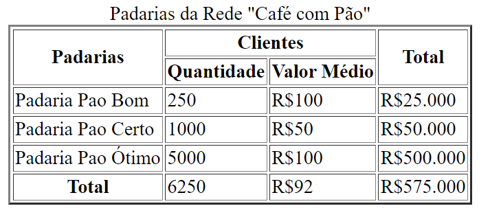
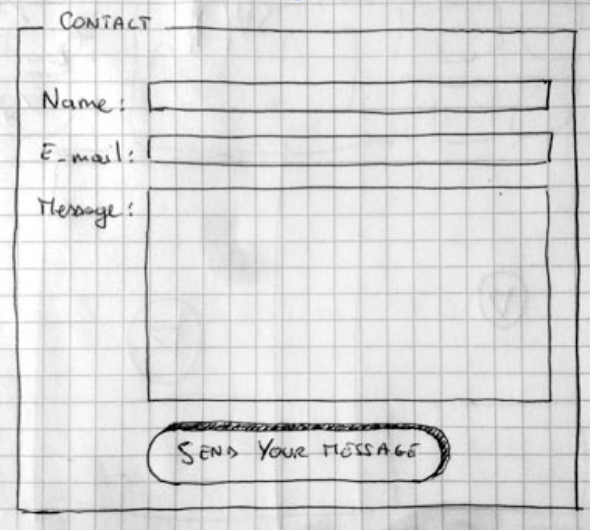

# A4 - Tabelas e Formulários

## Parte 1 - Tables

No seu repositório github das atividades na sala:
- Criar uma nova pasta chamada “a4_tabelas_formularios”
- No arquivo “index.html” reproduzir a tabela descrita abaixo
- Realizar o commit e push das alterações

## Parte 2 - Formularios

No seu repositório github das atividades na sala, na pasta anterior criada a4_tabelas_formularios:

- Criar um novo arquivo "contato.html" e reproduzir o formulario descrito abaixo
- O formulário é composto por 3 campos:
    - Seu nome, seu email, mensagem 
    - Botao de enviar mensagem
    - O atributo ‘action’ da tag ‘form’ deve ter o seguinte valor: ‘mailto:seuemail@email.com’  e o atributo ‘enctype’ deve ter o valor ‘text/plain’ e o atributo 'method' deve ter o valor 'post'
- Realizar o commit e push das alterações
- bonus: criar um hiperlink do arquivo index.html com as tabelas para o formulario de contato
- bonus: procurar sobre o elemento fieldset

