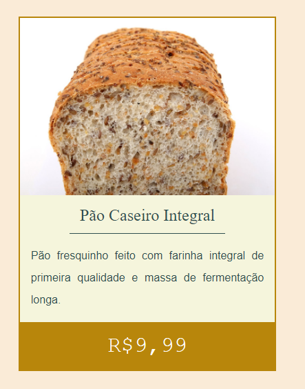

# A7 Margin Padding

No seu repositório do github de atividades

- Copiar a tarefa ‘a6-intro-css’ e renomear para ‘a7-margin-padding’
- Ou se preferir pode criar uma nova pagina que deve ter ao menos 1 imagem referente a um produto
- Criar um card para descrever um produto a partir dessa imagem
- Transformar a imagem do texto em um card que deve conter
    - Nome do produto
    - Breve descrição
    - Preço

Veja imagem a seguir para procurar reproduzir:

